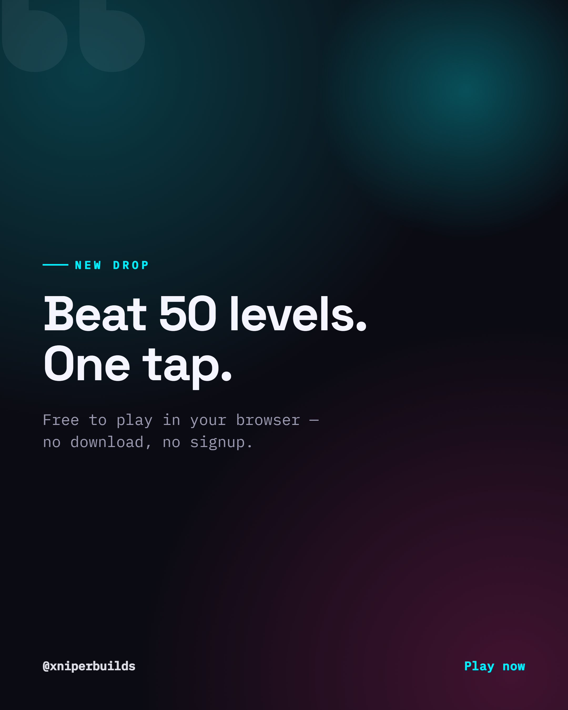
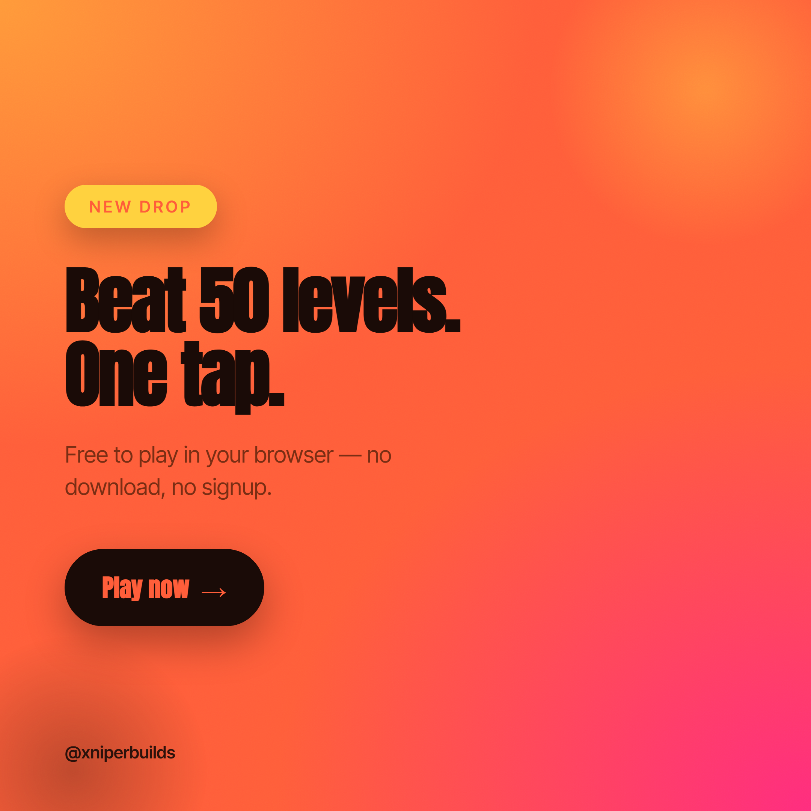
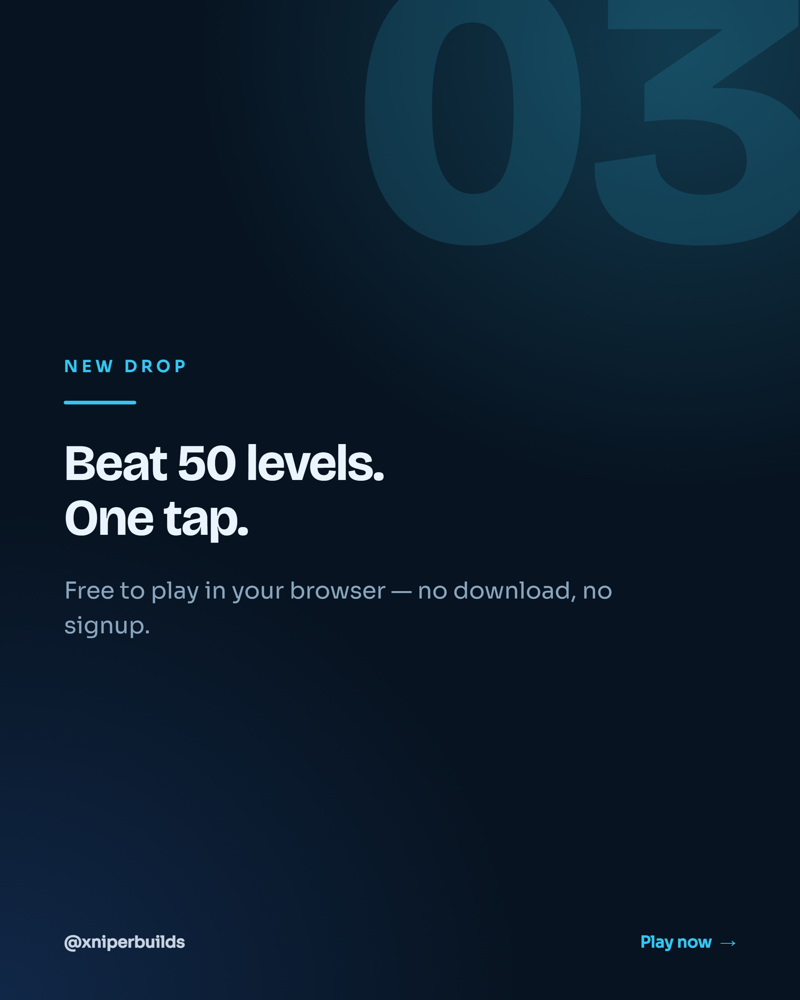

# Xniper Social Studio

**A Claude Code skill that designs premium, scroll-stopping social media graphics from a plain-text brief — and exports them to exact-size, post-ready PNGs.**

Most AI design output looks like... AI design output: flat, centered, purple-on-white, Inter everywhere. This skill is built to dodge every one of those tells and ship graphics that look like a senior art director made them — then render them to pixel-perfect PNGs for Instagram, TikTok, LinkedIn, X, YouTube, Pinterest, Facebook and Threads.

> Brief in → finished `.png` out. Not advice. Not a description. The actual image.

## Showcase

Four built-in templates, four palettes, four font pairings — all generated from one brief and rendered straight to PNG:

<p align="center">
  
  
  
  
</p>

---

## What it does

- **Brief → PNG pipeline.** You describe the post; it picks a palette + font pairing + layout, builds real HTML/CSS, and renders it to an exact-size PNG (2× / retina-crisp).
- **Premium by default.** A baked-in anti-slop ruleset: distinctive type, one locked accent, real depth (gradient mesh, grain, glow, layered shapes), brutal hierarchy. No generic templates.
- **Every platform & format.** Exact pixel sizes and safe zones for feed posts, portraits, stories, reel covers, carousels, thumbnails and pins.
- **Carousels done right.** Hook → points → CTA arc, one consistent system, varied layouts per slide.
- **Bring your brand.** Use a brand preset (colors / fonts / handle) or pass your own — works for anyone.

## Requirements

- [Claude Code](https://claude.com/claude-code)
- Python 3.9+
- [Playwright](https://playwright.dev/python/) for PNG export:
  ```bash
  pip install playwright
  python -m playwright install chromium
  ```
  (The render script auto-installs the Chromium binary if Playwright is present but the browser is missing.)

## Install

### Option A — Plugin marketplace (recommended)

In Claude Code:

```
/plugin marketplace add xniperbuilds/xniper-social-studio
/plugin install xniper-social-studio@xniperbuilds
```

Update later with `/plugin marketplace update xniperbuilds`.

### Option B — Manual

Copy the skill folder into your Claude Code skills directory:

```
plugins/xniper-social-studio/skills/xniper-social-studio  →  ~/.claude/skills/xniper-social-studio
```

## Usage

Just ask, in plain language:

- *"Design an Instagram carousel announcing my new game — 5 slides, bold neon look."*
- *"Make a LinkedIn post: '3 mistakes killing your landing page.'"*
- *"Quote card for a story, minimal luxury, dark + gold."*
- *"YouTube thumbnail for a speedrun video, high energy."*

The skill reads the brief, declares a design direction, builds the HTML, renders the PNG(s), and shows you the result to iterate on.

## How it's structured

```
skills/xniper-social-studio/
├── SKILL.md            # the design brain + pipeline
├── reference/          # platform sizes, design rules, layout recipes, copywriting
├── data/               # palettes, font pairings, templates, hooks, brand presets (JSON)
├── templates/          # parametrized premium HTML/CSS templates
└── scripts/            # search.py (recommend) · new_post.py (fill) · render.py (export)
```

## License

[MIT](LICENSE) © XniperBuilds
